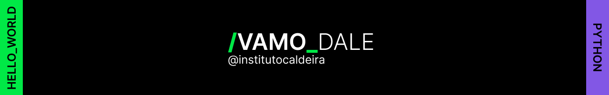

###### Repositório criado para os projetos realizados através do programa sem fins lucrativos do [@Instituto Caldeira](https://www.instagram.com/institutocaldeira) na trilha de Python!
### Conteúdo didático disponibilizado:
- [x] Lógica de Programação com JavaScript
- [x] Linguagem Python orientada a objetos + API
- [x] Variáveis, arrays, coleções e estruturas de controle

`JavaScript` `Python`
#### #ETERNOJEAN
